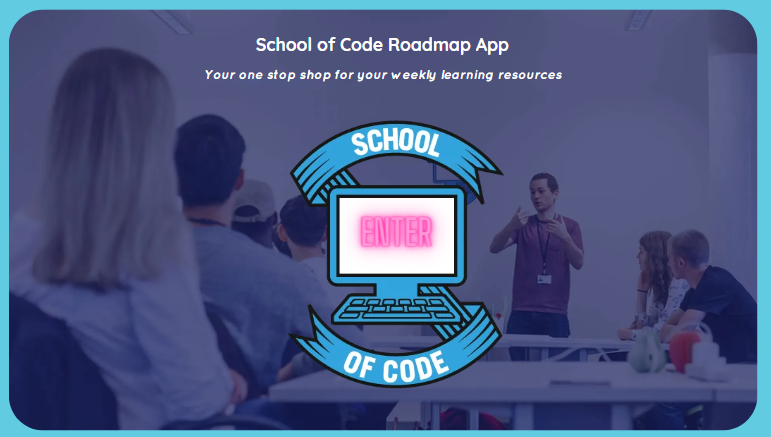

# Online Student Handbook by Hackstreet Boys

## Intro

Click for the app: <a href="https://student-handbook-bice.vercel.app/" target="_blank">Online Student Handbook!</a>

Produced by the Hackstreet Boys:
<ul>
    <li><a href="https://www.linkedin.com/in/dan-bennett-102a03149/">Dan Bennet</a></li>
    <li><a href="https://www.linkedin.com/in/jo-chattoo/">Jo Chattoo</a></li>
    <li><a href="https://www.linkedin.com/in/qasim-mohammed-65251517b/">Qasim Mohammed</a></li>
    <li><a href="https://www.linkedin.com/in/mateen-qureshi-msq/">Mateen Qureshi</a></li>
    <li><a href="https://www.linkedin.com/in/jordan-rutnam-080199161/">Jordan Rutnam</a></li>
</ul>

 

6 weeks into <a href="https://www.schoolofcode.co.uk/">School of Code</a> - which for a lot of us was 6 weeks since we started coding - and starting the 7th we were given our first project!

Put into random teams, we were given a <em>week</em> to create a react app that would help solve issues faced by fellow bootcampers. We spent the week ideating, planning and coding.

We had lots of fun!

## Technology

<ul>
    <li>React.js</li>
    <ul>
        <li>Material UI</li>
    </ul>
    <li>CSS</li>
    <li>Testing Library</li>
</ul>

## About

During the bootcamp, we were given many, many links (for videos, docs etc.) throught the weeks making it difficult to keep track of the links especially as the bootcamp progressed.

We decided to make a handbook, keeping everything in one place.

The app is designed to centralize all links in an online handbook, chronologically. If you were given a certain link about express.js on a Thursday on week 3, you would find it in the week 3 section, ready for use!

## Use

Upon entering the main page, you will find the weeks via a <a href="https://mui.com/material-ui/react-stepper/#horizontal-stepper">'horizontal stepper'</a> and the days organised by <a href="https://mui.com/material-ui/react-table/#collapsible-table">'collapsible tables'.</a> Lots of the data is placeholder. Unfortunately, there is no current way to edit the fields.

The app was intended:

<li>To be controlled by coaches, able to change links, videos  etc.</li>
<li>To be viewed by students, able to mark items as complete</li>

 

Students could then refer back to the handbook to see their GitHub classroom projects they had worked on throughout the week - along with any videos and docs the coaches had given, on demand, rather than trawling through conversations in Slack.

## Design

### Lo-Fi

Have a peek at our lo-fi designs:

 

Our landing page, it would load into one of a few main pages we had in mind, this design was the most accurate to what we actually created:

Minimal details, finding mutual understanding in what we wanted the app to look like in its bare bones.

<iframe style="border: 1px solid rgba(0, 0, 0, 0.1);" width="800" height="450" src="https://www.figma.com/embed?embed_host=share&url=https%3A%2F%2Fwww.figma.com%2Ffile%2FEQ7Jkq9EwWZV47oWAVxg0F%2FWireframe%3Ftype%3Ddesign%26node-id%3D0%253A1%26mode%3Ddesign%26t%3DODhFEka1IpO9YLnq-1" allowfullscreen></iframe>

### Hi-Fi

 

Again the landing page, loading into the main page, demonstrating how each feature we added may look like

## Future Goals

We never agreed to pick up the project again after presenting it to industry professionals but there would be much more to do which I may try!

<ul>
    <li>Add authorization and authentication for coaches and students:</li>
    <ul>
        <li>Allow coaches to change and edit links.</li>
        <li>Allow students to mark days and weeks as complete.</li>
        <li>Routing, params and database.</li>
    </ul>
    <li>Readjust tables and timeline to avoid cluttered appearance and scale better for more weeks (currently displaying 4 weeks of 16).</li>
</ul>
